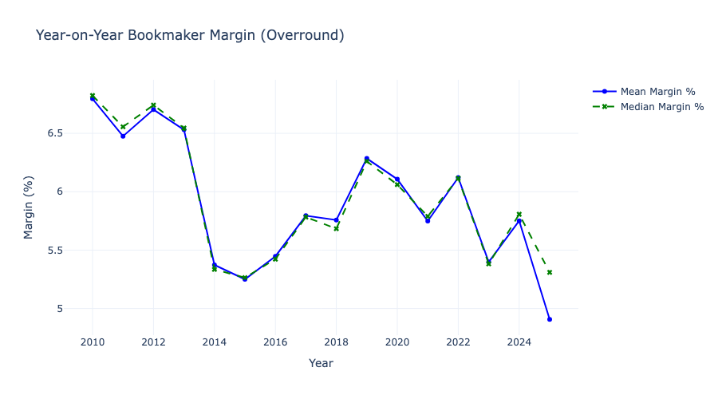
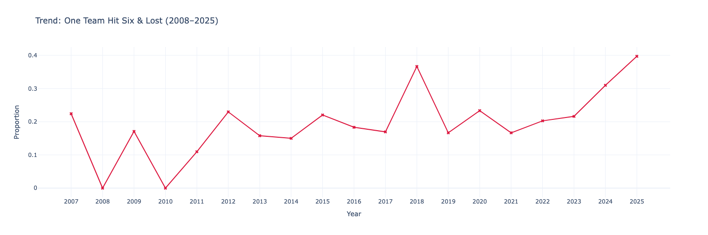

# IPL Betting Analysis Project

## Table of Contents

- [Disclaimer](#disclaimer)
- [Acknowledgments](#acknowledgments)
- [Why I Started This Project](#why-i-started-this-project)
- [Understanding the Stake.com Early Six, You Win IPL Offer](#understanding-the-stakecom-early-six-you-win-ipl-offer)
- [The Loophole in the Early Six Promotion](#the-loophole-in-the-early-six-you-win-promotion)
  - [The Strategy](#the-strategy)
  - [Worst-Case Scenario](#worst-case-scenario)
  - [Betting Smart](#betting-smart)
- [Data Analysis Process](#data-analysis-process)
  - [Bookmaker Margin Analysis](#bookmaker-margin-analysis)
  - [Main Graph Driving the Early Six Strategy](#main-graph-driving-the-early-six-strategy)
- [Conclusion](#conclusion)
- [The Main Concluding Showdown: Should You Bet or Not?](#the-main-concluding-showdown-should-you-bet-or-not)

## Disclaimer

Let me be clear from the start: this project is strictly for educational purposes. It’s a way for me to explore data analysis and test my skills in probability and statistics, driven by pure curiosity. I do not promote or encourage gambling in any form. Platforms like [Stake](https://stake.com) often use flashy promotions to lure people in, but make no mistake—they’re designed to profit in the long run. I’ll touch on that more at the end of this README. Also, a quick note: I’m not responsible for any actions or outcomes that result from using or interpreting this project. Proceed at your own discretion.

## Acknowledgments

I’d like to give a big thank you to those who helped make this project happen. First, a shoutout to my friend who spotted the loophole in [Stake](https://stake.com)’s promotion—you got the ball rolling! Huge thanks to ChatGPT for handling the boring stuff, like drafting parts of this documentation. I’m also grateful for the [Coursera Machine Learning Probability and Statistics course](https://www.coursera.org/learn/machine-learning-probability-and-statistics?specialization=mathematics-for-machine-learning-and-data-science) for breaking down probability and statistics for data analysis, teaching me key concepts like expected value, and introducing me to the basics of Pandas. Finally, a nod to the awesome resources that provided the data for this project:

- [Kaggle: IPL 2025 Records](https://www.kaggle.com/datasets/krishd123/ipl-2025-records)
- [Kaggle: IPL Complete Dataset (2008–2020)](https://www.kaggle.com/datasets/patrickb1912/ipl-complete-dataset-20082020)
- [OddsPortal.com](https://www.oddsportal.com), where I scraped the odds data to bring this analysis to life.

## 🎯 Why I Started This Project

Back when I was in my third year, I first heard about [Stake.com](https://stake.com)’s “Early Six, You Win” promotion. Honestly, I didn’t believe it at first—it sounded too good to be true. But then I saw my friends making some money with it during the 2024 IPL season, when the promotion covered the first four overs. Curious, I gave it a shot and played for about seven matches, and yeah, I made a bit of cash! 

But then Stake changed the rules, cutting it down to two overs, which made things trickier. Since I’m not a big cricket fan, I was happy with what I earned and stopped betting. 

Fast forward to 2025, I was deep into learning data science, especially in March when I took the [Coursera Machine Learning Probability and Statistics](https://www.coursera.org/learn/machine-learning-probability-and-statistics?specialization=mathematics-for-machine-learning-and-data-science) course. That’s when I learned about probability, statistics, and Pandas. 

It got me thinking: *if I had bet throughout the entire IPL season, would I have made a profit or a loss in the long run?*  
That curiosity sparked this project. I wanted to use data analysis to figure out if this promotion was a goldmine or a trap. 

**Spoiler: the results were pretty interesting!**

## Understanding the Stake.com Early Six, You Win IPL Offer

This project analyzes the “Early Six, You Win” promotion from Stake.com, a neat IPL betting offer that piqued my interest. Here’s how it works: you place a bet of at least $5 (or INR equivalent) on the Match Winner (including Super Over) market for any IPL match. If your team hits a six in the first two overs, your bet is insured (meaning you’re protected from a loss). There are two scenarios where you get a payout:

- You bet on a team, and they win the match—you get the standard payout for your winning bet.
- You bet on a team, and they lose the match but hit a six in the first two overs—you still get a payout, up to a maximum of $25 (approximately ₹2,080).

For full details on the rules and how to qualify, check out [SportyTrader](https://www.sportytrader.com/en/sports-betting/guide/stake-early-six-ipl-offer/). 

## The Loophole in the Early Six, You Win Promotion

Here’s where things get interesting: my friend pointed out a potential loophole in Stake.com promotion that could tilt the odds in your favor, and I’ve analyzed it as part of this project. The idea is to use two accounts to bet on both teams in the same IPL match under the “Early Six, You Win” promotion. Here’s how it plays out:

---

### The Strategy

Place a bet on Team A and Team B in the Match Winner (including Super Over) market, ensuring each bet is at least \$5 (or INR equivalent) to qualify for the promotion. 

If Team A hits a six in the first two overs **but loses**, and Team B **wins** the match, you could get payouts from **both bets**:

- Team A’s **insured payout** (up to ₹2,080)
- Team B’s **standard winning payout**

---

### Worst-Case Scenario

If one team doesn’t hit a six and loses, you’d only get a payout from the **winning team’s bet**.

Bookmakers like Stake.com make their profit through a **commission** (often called the “vig” or “juice”), typically around **5–7%** of the total implied probability for a match.

This means the combined implied probabilities of both teams winning exceed 100%, so in the worst case, you might **lose 5–7% of your total stake** across both bets.

---

### Betting Smart

To maximize the promotion, you want to aim for a payout of **₹2,080** from each bet.

You can calculate how much to bet on each team using simple math:

$$
\text{Required Bet} = \frac{₹2,080}{\text{Odds}}
$$

For example, if Team A has odds of 2.0:

$$
\frac{₹2,080}{2.0} = ₹1,040
$$

Do the same for Team B. This way, if the promotion conditions are met, you secure the **maximum payout** of ₹2,080 from the insured bet, and if the other team wins, you get a comparable payout based on their odds.

## Data Analysis Process

### Bookmaker Margin Analysis

I wanted to figure out how much loss I would take if I lose the strategy. To figure that out, I scraped the odds data from OddsPortal.com, took the difference of each match’s odds, and averaged it to a percentage year-on-year. The bookmaker margin is mostly in the range of 5 to 7 percent, with recent years (2023–2025) dropping to less than 6 percent.

#### Margin Formula

To figure out the bookmaker margin:

$$
\text{Margin \%} = \left( \frac{1}{\text{Odds}_1} + \frac{1}{\text{Odds}_2} - 1 \right) \times 100
$$

### Main Graph Driving the Early Six Strategy

Now that we know how much we might lose if the strategy fails (up to 7% based on the odds data), I need to figure out how often I’m going to win. This helps me check the expected profit or loss per match. To solve this, I analyzed the historical matches and deliveries data for the first two overs, flagging matches where one team hit a six and lost while the other won (regardless of hitting a six). I marked these as 1 and others as 0, then summed the flagged matches (1s) and divided by the total matches year-on-year.

#### Expected Return Formula

$$
EV = p \times \text{Payout} + (1 - p) \times (-\text{Margin Loss})
$$

## Conclusion

Upon analyzing, I saw that if I lose using my strategy, I would lose about 7 percent of what I put in, but if I win, I would make mostly 70 to 100 percent, which is really good. Also, after looking at the frequency of six hits each season, I found only 2 seasons where not a single match worked with our strategy, but in the remaining seasons, even the lowest percentage would still give us profit. Thereby, it can be said based on the data that it’s profitable to bet. For more information, check my `six_hit_analysis.ipynb` file—I’ve included detailed markdown for each graph and code too. This project was a fun dive into data, but remember—betting is risky, and the house always has an edge! 

## The Main Concluding Showdown: Should You Bet or Not?

Even though the analysis makes sense, there are important reasons why you should **not** engage in this strategy in real life.

I’ve personally seen a few of my friends’ accounts get banned because Stake figured out they were using the promotion and exploiting a loophole where they were consistently making profit. Stake tracks such behavior and eventually bans users from the promotion entirely.

Worse, I’ve seen others get drawn into **even riskier promotions**, becoming addicted and losing more money than they ever made. This happens because promotions like "Early Six" are **bait**—they're designed to lure users in, and once hooked, people often explore other high-risk games where losses pile up.

Stake and similar platforms likely use **A/B testing** to evaluate the effect of such promotions. They monitor player behavior before and after the offer and if it results in long-term profit for them, they continue or scale the promotion. It’s a deliberate psychological trap.

**My advice**: don’t fall for it. See this project purely as a data exploration and educational experiment. Understand the math, appreciate the analysis, but steer clear of the gambling itself.
